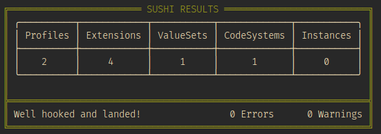

# COVID-19 Immunization IG

## Requirements

- [Sushi](http://sushi.org)
- [Jekyll](https://jekyllrb.com/)

## Running locally

To run the implementation guide on your machine please run the following commands:

- `./_updatePublisher.sh` to download or update the input publisher and cache it.
- `./_genonce.sh` to generate the implementation guide. An `output` directory will be generated with with all the assets for the implementation guide.

**NOTE:** Running `sushi` with no arguments will output useful summary information about the project, including the following table:

